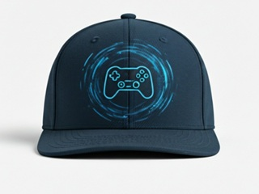

# M5-Stack Core Basic - Bluetooth Hat-TRACKER-GAMEPAD (HAT-GAMEPAD)
### Featuring the ICM-20948 IMU Sensor with DMP support

--------------------------------------------------------------------------------

## 📝 Project Description
A simple wireless **Hat-Tracker-Device (GAMEPAD version)** using **Bluetooth Low Energy (BLE)**. Designed to be attached to your head, it emulates a **USB-Gamecontroller-HID device** for your PC to control the camera's **yaw, nick, and roll movements**.
**Primary Use Case:** Designed to control the **PointOfView (POV)** in RC-Simulators (planes, helis, drones) to replace unrealistic "auto-follow" cameras.

While a Mouse version exists too, this Gamepad version is significantly better because:
*   It is **faster** and feels more **accurate and "direct"**
*   It sends **absolute values (RX, RY, RZ)** rather than relative delta-move values.

---

## 🛠 Hardware & Technical Details
*   **Microcontroller:** ESP32 (M5Stack Core Basic)
*   **Sensor:** ICM-20948 (SparkFun breakout board)
    *   **Mode:** Quat9 (Gyro + Accel + Magn)
    *   **Output:** 3 axis (RX, RY, RZ) sent out
*   **Display:** 320x240px LCD
*   **Indicators:** 2x Yellow/Blue Status LEDs via a NeoPixel Bar

---

## 🎮 Controls & Interaction

| Button | Action (Short Press) | Action (Long Press) |
| :--- | :--- | :--- |
| **[A]** | - | Power Off Device |
| **[B]** | Lock the current view | - |
| **[C]** | Toggle Tilt-Lock | Re-center Sensor |

*   **Power Management:** 
    *   Integrated M5-PowerButton or long-press **Button [A]**.
    *   10s screen-off delay when BT is connected.
    *   Automatic shutdown after 6 minutes if BT connection is off.
*   **Calibration:** The sensor requires **5–30 seconds** to warm up and stabilize. For best results, avoid starting while the sensor is not in a default position (like vertical).

---

## 💻 Software Setup (Example)
To use this with your simulation software, you can use:
1.  **Input:** [OpenTrack](https://github.com) (map the Joystick/Gamepad as Input).
2.  **Output:** Map to FreeTrack 2.0 or TrackIR protocol, depending on your specific SIM setup.

---

## ⚙️ Build Information
*   **Author:** @frittna
*   **Date:** 2. Feb 2026
*   **Environment:** Arduino IDE 1.8.19
*   **Platform:** ESP32
*   **To compile this code without errors load this board from Boardmanager:** 
*   **  **"espressif systems - eps32"** - Version **2.0.17** not newer not much older
*   **   Then select your Board: Menu->Tools->Board-> **"ESP32 Arduino" -> "M5-Stack-Core-ESP32"**
*   **   Use the old version of SDMenu-Loader library **0.5.2**

ToDo's: At the Moment no storing of gyro bias values is made for the next boot because the DMP is doing it's thing correctly but is just not accepting nor will he tell me its Accel and CPass values so that i can store them. maybe i will add it later. 

---
---
---

# M5-Stack Core Basic - Bluetooth Hat-TRACKER-MOUSE (HAT-MOUSE)
### Featuring the ICM-20948 IMU Sensor with DMP support

--------------------------------------------------------------------------------

## 📝 Project Description
A simple wireless **Hat-Tracker-Device (MOUSE version)** using **Bluetooth Low Energy (BLE)**. Designed to be attached to your head, it emulates a BT-HID Mouse to control the camera's **yaw and nick movements** on your PC.
**Primary Use Case:** Originally designed for RC-Simulators (planes, helis, drones) to replace the non-realistic "auto-follow" camera with natural head tracking.

**NOTE:** There is a superior **gamepad version** available. It is faster and sends absolute values (including the Z-axis), whereas this mouse version only sends X and Y delta-move values. This version is intended specifically for cases where mouse input is preferred over joystick input for any reasons.

---

## 🛠 Hardware & Technical Details
*   **Microcontroller:** ESP32 (M5Stack Core Basic)
*   **Sensor:** ICM-20948 (SparkFun breakout board)
    *   **Mode:** Quat9 (Gyro + Accel + Mag)
    *   **Output:** X and Y axis data
*   **Display:** 320x240px LCD
*   **Indicators:** 2x Yellow/Blue Status LEDs via a NeoPixel Bar

---

## 🎮 Controls & Interaction

| Button | Action (Short Press) | Action (Long Press) |
| :--- | :--- | :--- |
| **[A]** | - | Power Off Device |
| **[B]** | Lock-in Left Mouse Button | - |
| **[C]** | Toggle Tilt-Lock | Re-center Sensor |

*   **Power Management:** 
    *   Integrated M5-PowerButton.
    *   10s screen-off delay when BT is connected.
    *   Automatic shutdown after 6 minutes if BT connection is off.
*   **Calibration:** The sensor requires **5–30 seconds** to warm up and stabilize. For best results, avoid starting while the sensor is not in a default position (like vertical).

---

## ⚙️ Build Information
*   **Author:** @frittna
*   **Date:** 2. Feb 2026
*   **Environment:** Arduino IDE 1.8.19
*   **Platform:** ESP32
*   **To compile this code without errors load this board from Boardmanager:** 
*   **  **"espressif systems - eps32"** - Version **2.0.17** not newer not much older
*   **   Then select your Board: Menu->Tools->Board-> **"ESP32 Arduino" -> "M5-Stack-Core-ESP32"**
*   **   Use the old version of SDMenu-Loader library **0.5.2**

ToDo's: At the Moment no storing of gyro bias values is made for the next boot because the DMP is doing it's thing correctly but is just not accepting nor will he tell me its Accel and CPass values so that i can store them. maybe i will add it later. 

---
---
---

